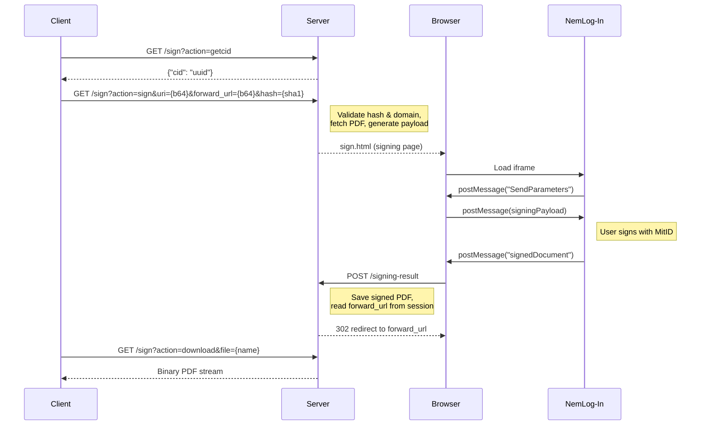

# ITKDev Signing Server

Standalone Spring Boot application for digital document signing via
[NemLog-In](https://www.nemlog-in.dk/). Acts as a stateless adapter: receives
PDF references over a simple HTTP API, presents the NemLog-In signing iframe,
and redirects back to the caller after signing.

```
Calling application → ITKDev Signing Server (this project) → NemLog-In
```

Any application that can make HTTP requests can integrate with the signing
server. For an example, see the
[OS2Forms digital_signature module](https://github.com/OS2Forms/os2forms/tree/develop/modules/os2forms_digital_signature).

## Requirements

- Docker and Docker Compose
- [Task](https://taskfile.dev/) (task runner)
- Git (to clone the NemLog-In SDK)
- An OCES3 certificate (`.p12`) registered with NemLog-In

**NOTE:** Java and Maven are not required locally. All build and run commands
execute inside Docker containers (`maven:3-eclipse-temurin-21`). A named Docker
volume (`os2forms-signing-m2`) is used to cache Maven dependencies between
builds.

## Installation

### 1. Clone the Repository

```bash
git clone <REPOSITORY_URL>
cd itkdev-signing-server
```

### 2. First-Time Setup

Run the setup task to clone the SDK, initialize configuration, and build
everything:

```bash
task setup
```

This performs three steps:

1. Clones the [NemLog-In Signing SDK](https://github.com/itk-dev/Signing-Server.git) into `Signing-Server/`
2. Copies `config/application.yaml.example` to `config/application.yaml`
3. Builds the SDK libraries and the webapp

### 3. Configure

Edit `config/application.yaml` with your NemLog-In credentials and application
settings:

```bash
$EDITOR config/application.yaml
```

Place your OCES3 certificate at `config/certificate.p12`.

### 4. Run

```bash
task dev
```

The application starts on port **8088** by default.

## Configuration

Configuration is split into two namespaces in `config/application.yaml`:

### NemLog-In SDK (`nemlogin.signing.*`)

| Variable | Description |
|----------|-------------|
| `signing-client-url` | NemLog-In signing client URL |
| `validation-service-url` | NemLog-In validation service URL |
| `entity-id` | Your entity ID registered with NemLog-In |
| `keystore-path` | Path to your OCES3 certificate (`.p12`) |
| `key-pair-alias` | Key pair alias in the keystore |
| `keystore-password` | Keystore password |
| `private-key-password` | Private key password |

**NemLog-In environments:**

| Environment | Signing Client URL | Validation URL |
|-------------|-------------------|----------------|
| Test | `https://underskrift.test-nemlog-in.dk/` | `https://validering.test-nemlog-in.dk/api/validate` |
| Production | `https://underskrift.nemlog-in.dk/` | `https://validering.nemlog-in.dk/api/validate` |

### Application (`itkdev.*`)

| Variable | Description | Default |
|----------|-------------|---------|
| `hash-salt` | Salt for SHA-1 hash validation of forward URLs. Must match the calling application. | *(required)* |
| `allowed-domains` | List of allowed domains for PDF URLs and forward URLs. | `[]` |
| `signed-documents-dir` | Directory for storing signed PDFs. | `./signed-documents/` |
| `source-documents-dir` | Directory for storing fetched source PDFs. | `./signers-documents/` |
| `debug` | Enable debug logging. | `false` |
| `test-page-enabled` | Enable the `/test` page for manual signing verification. Do **not** enable in production. | `false` |

**NOTE:** If `allowed-domains` is empty, all domains are allowed. This is not
recommended for production.

## Available Tasks

Run `task --list` to see all available tasks:

| Task | Description |
|------|-------------|
| `task setup` | Clone SDK, init config, and build everything |
| `task clone` | Clone the Signing-Server SDK repo |
| `task build:sdk` | Build SDK libraries (install to local Maven repo) |
| `task build:sdk:force` | Force rebuild SDK libraries (ignores cache) |
| `task build` | Build the webapp |
| `task build:all` | Build SDK + webapp |
| `task dev` | Run in development mode (`mvn spring-boot:run`) |
| `task run:jar` | Run the built JAR directly |
| `task clean` | Maven clean |
| `task config:init` | Copy example config to `application.yaml` |
| `task docker:build` | Build the Docker image |
| `task docker:push VERSION=x.y.z` | Build and push Docker image to GHCR |

## API

The application serves a built-in API reference at the landing page (`/`). Open
the running service in a browser to see full endpoint documentation, parameter
descriptions, and the signing flow diagram.

All actions are served from a single endpoint `GET /sign` with an `action`
query parameter:

| Action | Description |
|--------|-------------|
| `getcid` | Health check — returns a correlation ID |
| `sign` | Initiate signing (requires `uri`, `forward_url`, `hash`) |
| `result` | Redirect to `forward_url` after successful signing |
| `cancel` | Redirect to `forward_url` after cancellation |
| `download` | Download the signed PDF |

The signing result callback from the NemLog-In iframe is handled at
`POST /signing-result`.

## Signing Flow



## Deployment

### Docker Image

The Docker image is published to GitHub Container Registry:

```
ghcr.io/itk-dev/signing-server
```

#### Using a Pre-Built Image

Pull and run the image directly without building from source:

```bash
docker pull ghcr.io/itk-dev/signing-server:latest
docker run --rm -p 8088:8088 \
  -v ./config/application.yaml:/app/config/application.yaml:ro \
  -v ./config/certificate.p12:/app/config/certificate.p12:ro \
  -v ./signed-documents:/app/signed-documents \
  -v ./signers-documents:/app/signers-documents \
  -v ./temp-documents:/app/temp-documents \
  ghcr.io/itk-dev/signing-server:latest
```

#### Building the Image Locally

Build and optionally push using Task:

```bash
task docker:build                    # Build image locally
task docker:push VERSION=1.0.0      # Build, tag, and push to GHCR
```

Or build directly with Docker:

```bash
docker build -t ghcr.io/itk-dev/signing-server:latest .
```

**NOTE:** The SDK source (`Signing-Server/`) must be present before building the
image. Run `task clone` first if it hasn't been cloned yet.

#### Image Architecture

The Dockerfile uses a two-stage build:

1. **build** — Builds the SDK libraries and the webapp (`maven:3-eclipse-temurin-21`)
2. **final** — Runtime with minimal JRE image (`eclipse-temurin:21-jre-jammy`), runs as non-root user (`appuser`) on port 8088

### Docker Compose

Build and run with Docker Compose for local development:

```bash
docker compose build
docker compose up -d
```

The service is accessible through the nginx reverse proxy on port **8080**.

**Required volumes:**

| Host Path | Container Path | Description |
|-----------|---------------|-------------|
| `config/application.yaml` | `/app/config/application.yaml` | Application configuration |
| `config/certificate.p12` | `/app/config/certificate.p12` | OCES3 certificate |

**Optional volumes (document storage):**

| Host Path | Container Path | Description |
|-----------|---------------|-------------|
| `signed-documents/` | `/app/signed-documents` | Signed PDF output |
| `signers-documents/` | `/app/signers-documents` | Fetched source PDFs |
| `temp-documents/` | `/app/temp-documents` | Temporary files during signing |

**Environment variables (`.env`):**

| Variable | Description | Default |
|----------|-------------|---------|
| `COMPOSE_PROJECT_NAME` | Docker Compose project name | `sign-server` |
| `COMPOSE_DOMAIN` | Domain for Traefik routing (local dev) | `sign.local.itkdev.dk` |
| `MAX_UPLOAD_SIZE` | Max upload size for nginx and Spring | `56M` |
| `MAX_UPLOAD_SIZE_BYTES` | Max upload size in bytes for Tomcat | `58720256` |

### Production (Traefik)

For production with Traefik and HTTPS, set the required environment variables
and use the server compose file:

```bash
export COMPOSE_PROJECT_NAME=os2forms-signing
export COMPOSE_SERVER_DOMAIN=signing.example.dk

docker compose -f docker-compose.server.yml build
docker compose -f docker-compose.server.yml up -d
```

Nginx sits in front of the signing server as a reverse proxy on port 8080.

## Test Signing Page

The application includes a self-contained test page at `/test` for verifying
the NemLog-In integration without an external system. The test page allows you
to:

1. Upload a PDF document
2. Sign it via the NemLog-In iframe (MitID authentication)
3. Validate the signature against the NemLog-In validation API
4. Download the signed PDF

The test page is disabled by default. Enable it by setting `itkdev.test-page-enabled: true`
in `config/application.yaml`.

**WARNING:** The test page bypasses hash validation and domain whitelisting. Do
**not** enable it in production.

## Verification

After starting the application, verify it works:

1. **Built-in documentation:** Open `http://localhost:8088/` in a browser. You
   should see the API reference page.

2. **Health check:**
   ```bash
   curl http://localhost:8088/sign?action=getcid
   ```
   Expected: `{"cid":"<UUID>"}`

3. **Error handling:**
   ```bash
   curl "http://localhost:8088/sign?action=sign&uri=dGVzdA==&forward_url=dGVzdA==&hash=invalid"
   ```
   Expected: `{"error":true,"message":"Incorrect hash value","code":0}`

4. **Test page (if enabled):** Open `http://localhost:8088/test`, upload a PDF,
   and complete the signing flow.

## Related Repositories

- [NemLog-In Signing SDK](https://github.com/itk-dev/Signing-Server.git) — SignSDK v2.0.2 (build dependency)
- [OS2Forms digital_signature](https://github.com/OS2Forms/os2forms/tree/develop/modules/os2forms_digital_signature) — Example client integration (Drupal module)

## License

This project is licensed under the [Mozilla Public License 2.0](LICENSE).
